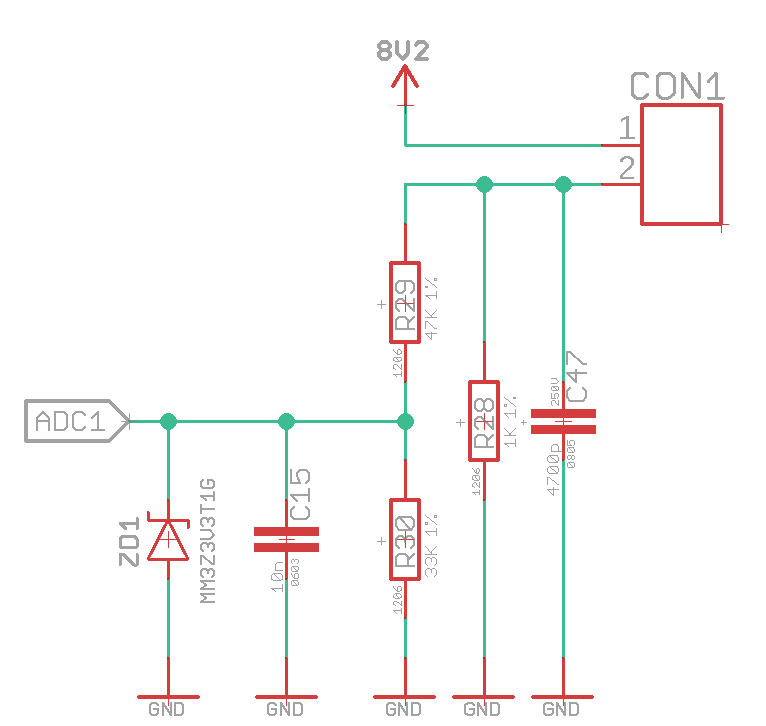
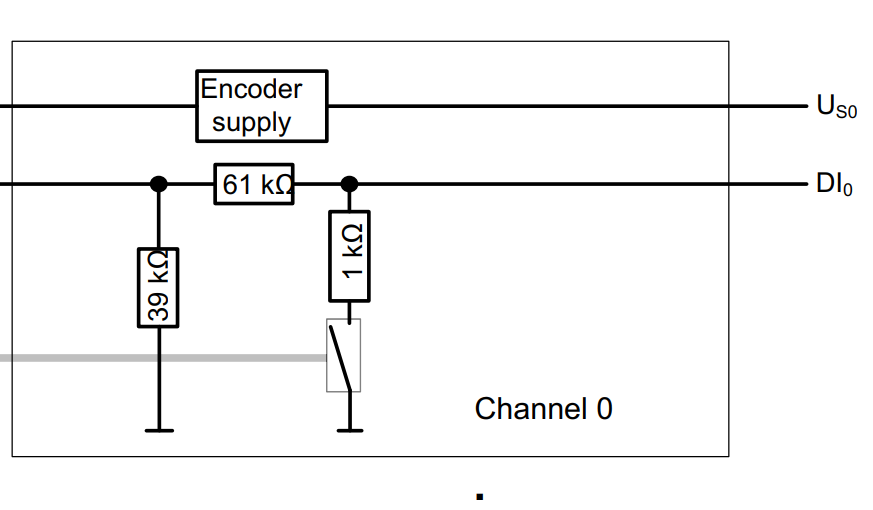
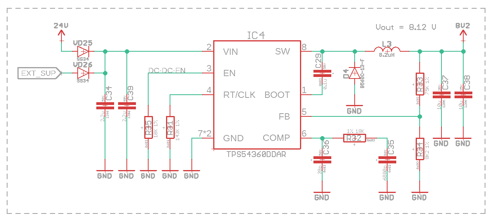

В это репозитории хранятся исходные файлы проекта промышленного контроллера с Namur-входами

## Соображения

Ниже приведена схема одного измерительного канала

Эта схема, хотя и не копирует 1 в 1, но все же весьма похожа на схему из контроллера Siemens SIMATIC ET200SP, ниже приведена картинки из [мануала](https://cache.industry.siemens.com/dl/files/246/109747246/att_921248/v1/et200sp_ha_di_16xnamur_manual_en-US_en-US.pdf) на этого контроллер (раздел 3.2).

Запитывать все каналы предполагается от шины питания 8.2 вольта, которая должна быть организована внутри устройства. Например, на DC-DC конвертере TPS54360:

При этом для создания шины 8.2 вольта может быть использована как внутренняя шина 24 В устройства, так и 24 вольта, подаваемые извне. 

## Количество каналов

Есть веские причины остановиться на 16 каналах для этого устройства. В пользу такого решения говорят следующие причины:

1) В этом устройстве конструктивно можно размеситить максимум 34-пиновый разъем для подключения датчиков. При этом типичный датчик имеет 2-проводную схему подключения. Хотя технически возможно увеличить количество каналов в 2 раза, монтаж в таком случае окажется крайне неряшливый и неудобный. 
2) В микроконтроллере stm32f412 16-канальный АЦП. В случае бОльшего количества каналов пришлось бы использовать дополнительные аналоговые коммутаторы. А с 16 каналами можно обойтись только микроконтроллером. Меньше BoM, проще устройство. 
3) Если на практике требуется больше 16 каналов Namur (что вообще-то не так уж и мало), можно просто установить дополнительные устройства.

## Версия на 32 канала